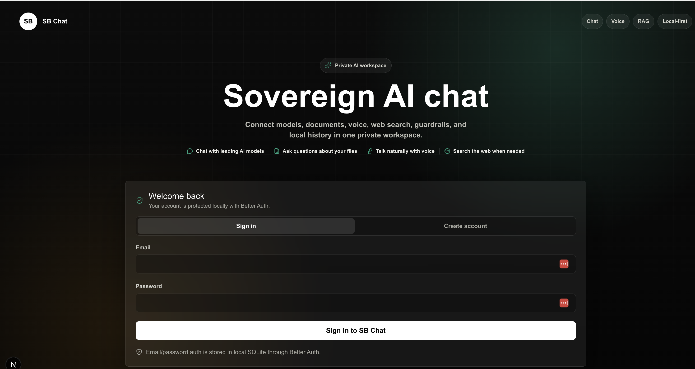

<h1 align="center">SB Chat - The Sovereign AI Chat</h1>

<p align="center">
  Created by <a href="https://suhasbhairav.com"><strong>Suhas Bhairav</strong></a>
</p>

<p align="center">
  
</p>


**SB Chat** is a sovereign, Next.js-native AI chat workspace for local models, hosted model APIs, document chat, voice, web search, authenticated users, protected APIs, and local-first persistence.

Built by **[Suhas Bhairav](https://suhasbhairav.com)**.

---

## What It Is

SB Chat is a polished alternative to Open WebUI built as a straightforward JavaScript Next.js app. It is designed for people who want control over their AI stack: local Ollama models, bring-your-own API keys, OpenAI-compatible servers, local JSON data files, local SQLite auth sessions, and no mandatory hosted identity provider.

The product goal is **sovereign AI**: the app can run privately on your machine or server while still supporting OpenAI, Claude, Grok, Sarvam AI, OpenRouter, Ollama, and custom OpenAI-compatible endpoints.

---

## Current Capabilities

### Sovereign Authentication

- Better Auth email/password authentication
- Local SQLite auth database at `data/sb-chat-auth.sqlite`
- Uses Node's built-in `node:sqlite` driver, avoiding native `better-sqlite3` rebuild issues
- Local sessions with HTTP-only cookies
- Sign in, create account, and sign out UI
- Default sign-up name set to Suhas Bhairav
- Protected app APIs for chat, library, models, documents, token usage, and realtime sessions
- Auth database ignored by git
- Migration script: `npm run auth:migrate`

### Chat Experience

- ChatGPT-style dark/light interface
- SB-branded circular chat icon
- Streaming assistant responses
- Markdown rendering through `react-markdown` and `remark-gfm`
- Vertical scrolling for chat history and composer input
- Temporary chat mode with visible banner and no history persistence
- Copy assistant messages
- Import/export individual chats and the full chat library
- Workspaces and folders
- Move chats between folders
- Search across saved chats and message content

### Providers

- [Ollama](https://ollama.com) via `http://localhost:11434`
- [OpenAI](https://platform.openai.com/docs) Chat Completions
- [OpenAI Web Search](https://platform.openai.com/docs/guides/tools-web-search) through the Responses tools flow
- [OpenAI Realtime](https://platform.openai.com/docs/guides/realtime) voice sessions
- [OpenRouter](https://openrouter.ai/models) chat completions
- [Claude](https://docs.anthropic.com) through Anthropic Messages API
- [Grok](https://docs.x.ai) through xAI API
- [Sarvam AI](https://docs.sarvam.ai/api-reference/chat/chat-completions) chat completions
- Custom OpenAI-compatible endpoints such as [LM Studio](https://lmstudio.ai), [vLLM](https://docs.vllm.ai), [llama.cpp](https://github.com/ggml-org/llama.cpp), and [LiteLLM](https://docs.litellm.ai)
- Server-side `.env` API key fallback
- Runtime API key entry in Settings

### Model Selection

- Provider-specific model picker
- OpenAI model catalog support
- OpenRouter model catalog support
- Ollama local model discovery from `/api/tags`
- Claude, Grok, and Sarvam catalog fallbacks
- Manual model entry for custom endpoints
- Compatibility handling for models such as `gpt-5-nano` that require default temperature

### Voice Chat

- OpenAI Realtime over WebRTC
- Server-created ephemeral realtime client secret
- Automatic realtime model resolution
- Browser microphone streaming
- Spoken assistant replies
- User transcript inserted into chat

### Web Search

- Web Search toggle inside the chat composer plus menu
- OpenAI-only hosted search flow
- Search stays below the composer control and uses an opaque dropdown surface
- Streaming answer integration with normal chat messages

### Guardrails

- Comprehensive guardrails switch
- Server-side request screening
- Safer system behavior toggle
- Detection for prompt extraction, secret exposure, and high-risk cyber requests
- Raw model mode remains available when guardrails are disabled

### Document Chat and RAG

- Documents page for upload, list, search, download, delete, and reindex
- Uploads: PDF, TXT, Markdown, JSON, LOG, CSV, XLS, XLSX, DOCX
- Local hashed embeddings for private/offline indexing
- OpenAI embeddings with `text-embedding-3-small`
- Local JSON vector storage by default
- Optional ChromaDB vector storage with configurable URL and collection
- Configurable chunk size, overlap, and Top K
- `Enable Document Chat` top-bar toggle
- Document-grounded system prompt that refuses unsupported answers
- Source labels appended to answers

### Token Usage

- JSON usage ledger at `data/token-usage.json`
- Input tokens
- Output tokens
- Total tokens
- Requests by provider, model, and day
- Recent usage events
- Temporary chat usage is tracked even when chat history is not saved

### Internationalization

SB Chat intentionally exposes only languages with complete curated UI coverage:

- English
- German
- Spanish
- Simplified Chinese
- Hindi
- Kannada

Locale preference is stored in browser settings. User-generated data, model output, chat titles, folder names, and document names are intentionally not translated.

---

## Tech Stack

| Layer | Technology |
| --- | --- |
| Framework | Next.js 16 App Router |
| UI | React 19 |
| Styling | Tailwind CSS 4 + custom product CSS tokens |
| Icons | Lucide React |
| Auth | Better Auth |
| Auth DB | Local SQLite through Node `node:sqlite` |
| Chat Storage | Local JSON files |
| Markdown | `react-markdown` + `remark-gfm` |
| Documents | `mammoth`, `xlsx`, local file processing |
| Vector DB | Local JSON vectors, optional ChromaDB through `chromadb` |
| Voice | OpenAI Realtime WebRTC |
| Providers | Ollama, OpenAI, Claude, Grok, Sarvam AI, OpenRouter, OpenAI-compatible APIs |

---

## Project Structure

```text
sb-chat/
  app/
    api/
      auth/[...all]/       # Better Auth route
      chat/                # Streaming chat endpoint
      documents/           # RAG document library API
      library/             # JSON chat library API
      models/              # Provider model catalogs
      realtime/session/    # OpenAI Realtime ephemeral sessions
      token-usage/         # Token usage summary API
    globals.css            # Product UI system
    layout.js
    page.js                # Auth gate + chat shell composition

  components/
    auth/                  # Better Auth sign-in/sign-up gate
    brand/                 # SB brand mark
    chat/                  # Composer, messages, empty state
    docs/                  # In-app docs and document manager
    i18n/                  # Runtime localization provider
    layout/                # Sidebar, top bar, footer
    settings/              # Settings drawer
    usage/                 # Token usage drawer

  hooks/
    useChatController.js   # Chat state and orchestration
    useRealtimeVoice.js    # WebRTC voice lifecycle

  lib/
    auth.js                # Better Auth server config
    auth-client.js         # Better Auth React client
    auth-session.js        # Server session guard helpers
    chat-request.js        # Request validation and normalization
    chat-store.js          # JSON chat persistence
    guardrails.js          # Guardrail screening and system prompts
    i18n.js                # Locale registry and message catalogs
    i18n-full-overrides.js # Complete curated language catalogs
    model-catalog.js       # Model discovery and fallbacks
    model-clients.js       # Provider streaming clients
    rag-*.js               # RAG storage, processing, embeddings
    token-usage-store.js   # Usage ledger and summaries

  data/
    chat-store.json
    document-store.json
    token-usage.json
    sb-chat-auth.sqlite    # Local auth DB, gitignored

  scripts/
    migrate-auth.mjs       # Better Auth SQLite migration
```

For deeper module notes, see [ARCHITECTURE.md](./ARCHITECTURE.md).

---

## Getting Started

### 1. Install dependencies

```bash
npm install
```

SB Chat uses the `chromadb` TypeScript client for optional ChromaDB vector storage. Do not install `@chroma-core/default-embed`; SB Chat creates embeddings itself and sends precomputed vectors to Chroma. The default embed package currently breaks Next.js/Turbopack builds in this app.

### 2. Configure environment variables

Create `.env` in the project root:

```bash
BETTER_AUTH_SECRET=replace_with_a_long_random_secret
BETTER_AUTH_URL=http://localhost:3000
BETTER_AUTH_DB_PATH=data/sb-chat-auth.sqlite

OPENAI_API_KEY=your_openai_api_key
OPENROUTER_API_KEY=your_openrouter_api_key
ANTHROPIC_API_KEY=your_anthropic_api_key
XAI_API_KEY=your_xai_api_key
SARVAM_API_KEY=your_sarvam_api_key
```

Notes:

- `BETTER_AUTH_SECRET` is required for production-quality sessions.
- `BETTER_AUTH_URL` should match the public URL of your deployment.
- `BETTER_AUTH_DB_PATH` defaults to `data/sb-chat-auth.sqlite`.
- Provider API keys can also be entered at runtime inside Settings.
- Server-side `.env` values are used when the Settings key field is empty.
- Restart Next.js after editing `.env`.

### 3. Create or update auth tables

```bash
npm run auth:migrate
```

This creates the Better Auth tables:

```text
user
session
account
verification
```

### 4. Run the app

```bash
npm run dev
```

Open:

```text
http://localhost:3000
```

Create a local account, then configure your provider/model settings.

---

## Provider Notes

### Ollama

[Ollama](https://ollama.com) runs local models on your machine.

```bash
ollama pull llama3.1
ollama serve
```

Settings:

- Provider: `Ollama`
- Base URL: `http://localhost:11434`
- Model: any installed Ollama model

### OpenAI

[OpenAI Platform](https://platform.openai.com/docs) powers chat, hosted [web search](https://platform.openai.com/docs/guides/tools-web-search), [embeddings](https://platform.openai.com/docs/guides/embeddings), and [realtime voice](https://platform.openai.com/docs/guides/realtime). You can review model availability and costs on the [OpenAI pricing page](https://platform.openai.com/docs/pricing).

```bash
OPENAI_API_KEY=...
```

SB Chat automatically avoids sending unsupported temperature values to models that only allow the default.

### OpenRouter

[OpenRouter](https://openrouter.ai) provides routed access to many model families. SB Chat can use the [OpenRouter model directory](https://openrouter.ai/models) and OpenAI-compatible chat API.

```bash
OPENROUTER_API_KEY=...
```

Use the OpenAI-compatible API shape with your OpenRouter key.

### Claude

[Claude](https://www.anthropic.com/claude) is available through the [Anthropic API docs](https://docs.anthropic.com) and Messages API.

```bash
ANTHROPIC_API_KEY=...
```

Streaming and provider usage are supported when available.

### Grok

[Grok](https://x.ai) is available through the [xAI API docs](https://docs.x.ai).

```bash
XAI_API_KEY=...
```

Streaming responses are supported.

### Sarvam AI

[Sarvam AI](https://www.sarvam.ai) is supported through its [chat completions API](https://docs.sarvam.ai/api-reference/chat/chat-completions).

```bash
SARVAM_API_KEY=...
```

Sarvam AI is included as a first-class provider.

### Custom OpenAI-Compatible Servers

Examples:

- [LM Studio](https://lmstudio.ai)
- [vLLM](https://docs.vllm.ai)
- [llama.cpp server](https://github.com/ggml-org/llama.cpp)
- [LiteLLM](https://docs.litellm.ai)
- OpenAI-compatible internal gateways

Set the provider to custom/OpenAI-compatible, enter your base URL, and use the model ID expected by that server.

---

## Document Chat

Open the Documents icon in the top bar to manage the RAG library.

Supported uploads:

- PDF
- TXT, Markdown, JSON, LOG
- CSV
- XLS, XLSX
- DOCX

PDF extraction uses local tooling. On macOS, install Poppler if PDF extraction needs it:

```bash
brew install poppler
```

Embedding modes:

- `Local embeddings`: deterministic local hashed vectors, no API key required.
- `OpenAI embeddings`: uses `text-embedding-3-small`.

Vector storage modes:

- `Local JSON vectors`: stores chunk vectors in `data/document-store.json`. This is the default and needs no extra service.
- `ChromaDB`: stores chunk vectors in a running Chroma server while SB Chat keeps document metadata locally.

To use ChromaDB locally, start Chroma before uploading or reindexing documents:

```bash
npx chroma run --path ./data/chroma
```

If you use Yarn:

```bash
yarn chroma run --path ./data/chroma
```

Then open **Documents -> Vector storage** and set:

```text
Vector store: ChromaDB
Chroma URL: http://localhost:8000
Chroma collection: sb_chat_documents
```

Install only the Chroma client package:

```bash
npm install chromadb
```

Do not run:

```bash
npm install @chroma-core/default-embed
```

or:

```bash
yarn add @chroma-core/default-embed
```

SB Chat already computes embeddings through its configured embedding mode and queries Chroma with precomputed vectors.

When Document Chat is enabled, SB Chat retrieves relevant chunks, injects them into the model request, and instructs the model to answer only from retrieved context.

---

## Data and Privacy

SB Chat uses local files by default:

```text
data/chat-store.json
data/document-store.json
data/memory-store.json
data/token-usage.json
data/sb-chat-auth.sqlite
```

The auth SQLite file and memory store are ignored by git. The API key typed into Settings lives in React state and is not persisted to local storage. Temporary chats are not written to `data/chat-store.json`.

---

## Scripts

```bash
npm run dev           # Start local development
npm run build         # Build production app
npm run start         # Start production server
npm run lint          # Run ESLint
npm run auth:migrate  # Create/update Better Auth SQLite schema
```

---

## Production Notes

Before exposing SB Chat outside a trusted local network:

- Rotate any API key that has ever been logged or committed
- Set a strong `BETTER_AUTH_SECRET`
- Set `BETTER_AUTH_URL` to the deployed origin
- Add HTTPS
- Add rate limits
- Consider per-user chat/document/token stores
- Encrypt provider API keys if you decide to persist them
- Add audit logs for auth, guardrails, imports, exports, and document actions
- Consider Postgres or another durable database for multi-user deployments

---

## Creator

Built by **[Suhas Bhairav](https://suhasbhairav.com)**.

Part of the broader AI tooling work by Suhas Bhairav.

---

## License

MIT License.

Copyright (c) 2026 [Suhas Bhairav](https://suhasbhairav.com).

See [LICENSE](./LICENSE).
