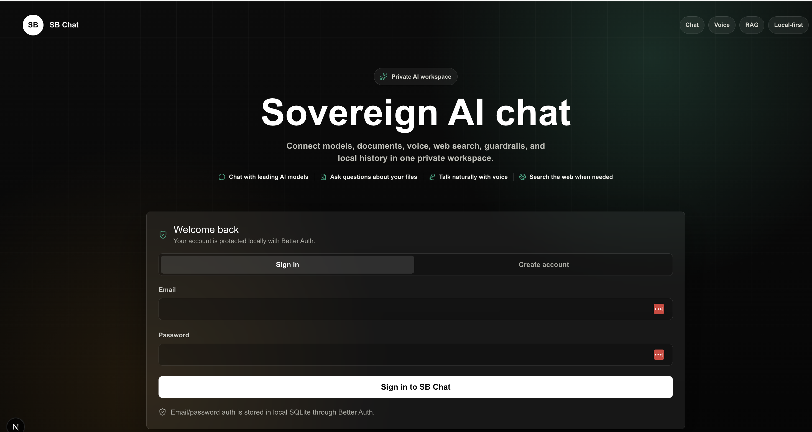

<h1 align="center">Batuk</h1>

<p align="center">
  <strong>Sovereign AI chat for teams: local models, frontier LLMs, document RAG, workspace privacy, and an OpenAI-compatible API gateway in one enterprise workspace.</strong>
</p>

<p align="center">
  Created by <a href="https://suhasbhairav.com"><strong>Suhas Bhairav</strong></a>
</p>

<p align="center">
  
</p>

<p align="center">
  <a href="https://app.arcade.software/share/videos/UZnHQSj8q0OA8UurPFvW">
    <strong>Watch the Batuk demo video</strong>
  </a>
</p>


<p align="center">
  <a href="https://vercel.com/new/clone?repository-url=https%3A%2F%2Fgithub.com%2Fsuhasbhairav%2Fsb-chat&project-name=batuk&repository-name=batuk">
    
  </a>
  <a href="https://render.com/deploy?repo=https%3A%2F%2Fgithub.com%2Fsuhasbhairav%2Fsb-chat">
    
  </a>
  <a href="https://railway.com/new/template?template=https%3A%2F%2Fgithub.com%2Fsuhasbhairav%2Fsb-chat&utm_campaign=batuk">
    
  </a>
</p>

Batuk is a fully open-source enterprise-native AI platform for teams. Its main purpose is simple: give users one polished chat interface for every model they are allowed to run, from local Ollama models to OpenAI, Claude, Grok, Sarvam AI, Together, Mistral, Kimi, DeepSeek, Qwen, Perplexity, OpenRouter, and private OpenAI-compatible gateways, with document RAG, enterprise authentication, admin controls, audit evidence, and deployment-friendly storage.

Batuk is local-first by default and enterprise-ready when you need it. Run it on a laptop with JSON files and SQLite, or deploy it in a client environment with Docker, PostgreSQL/MySQL product data, Better Auth enterprise identity, ChromaDB, and private file storage.

## Why Batuk

- **Chat with any model:** Ollama, OpenAI, OpenRouter, Claude, Grok, Sarvam AI, Together AI, Mistral AI, Kimi, DeepSeek, Qwen, Perplexity, and custom OpenAI-compatible servers such as LM Studio, vLLM, llama.cpp, LiteLLM, or internal gateways.
- **Bring your documents:** upload, search, reindex, download, and delete documents with RAG over PDF, TXT, Markdown, JSON, LOG, CSV, XLS, XLSX, and DOCX.
- **Choose your vector store:** local JSON vectors by default, ChromaDB for self-hosted vector search, or Pinecone for managed vector search.
- **Built for teams:** Better Auth users, admins, roles, organizations, teams, invitations, SSO, OAuth/OIDC provider support, and SCIM provisioning.
- **Enterprise operations:** GDPR request workflows, audit trail, CSV evidence export, ISO 27001/SOC 2 control register, token usage, and organization-scoped storage.
- **Internal model API gateway:** users can generate personal API keys and call admin-enabled models through OpenAI-compatible endpoints.
- **Whitelabel by organization:** admins can set product name, tagline, accent color, initials, and uploaded logo while the footer always preserves Batuk attribution.

## Core Features

### Multi-Model Chat

- Streaming responses with Markdown rendering.
- Provider-specific model picker and manual model entry.
- Runtime Settings for local evaluation and server-side configuration for deployments.
- Temporary chat mode that avoids history persistence.
- Personal workspaces, shared workspaces, folders, search, import, export, and copy actions.
- A Workspace tools menu with separate pages for Provider settings, API access, Workspace management, Chat history and data, Token usage, Enterprise management, and Audit and compliance.
- Web search through OpenAI hosted search when enabled.
- OpenAI Realtime voice sessions with browser microphone input.
- Guardrails for safer request screening and system behavior.

### Document Chat and RAG

- Upload documents from the Documents workspace.
- Extract text, chunk content, embed chunks, and retrieve relevant context during chat.
- Use local deterministic embeddings for offline/private indexing or OpenAI embeddings for higher-quality semantic search.
- Store vectors in local JSON, ChromaDB, or Pinecone.
- Personal document uploads and memories are private to the signed-in user, even when the user belongs to an organization.
- Shared workspace RAG is available only inside an admin-created shared workspace and only to admins or users added to that workspace.
- ChromaDB and Pinecone chunks carry scope metadata so retrieval filters by personal or workspace scope before context reaches the model.
- Download always returns the original uploaded file.
- Delete removes local metadata, source files, chunk records, and remote vectors when ChromaDB or Pinecone is used.
- Pinecone index dimension handling supports both local 384-dimensional embeddings and 1536-dimensional OpenAI embeddings.

### Enterprise Identity

- Better Auth email/password authentication.
- Admin plugin for users, roles, bans, password resets, and admin APIs.
- Organization plugin for organizations, teams, members, invitations, and organization roles.
- Dashboard plugin support for Better Auth infrastructure visibility.
- OAuth 2.1/OIDC provider support with consent page.
- SSO plugin for enterprise OIDC/SAML sign-in.
- SCIM plugin for identity-provider provisioning.
- Protected product APIs for chat, documents, skills, agents, usage, memory, models, attachments, realtime sessions, and workflows.

### Administration

- First-owner bootstrap when no owner/admin exists.
- Full admin user CRUD: create, view, update, reset password, ban, unban, and delete users.
- Organization creation and active organization switching.
- Team creation, member invitations, and role management.
- Shared workspace CRUD for admins: create, rename, enable/disable workspace RAG, delete, add users by email, and remove users from the workspace member list.
- Enterprise whitelabel controls with logo upload and locked footer attribution.

### API Access and Model Gateway

- Every signed-in user can open **API access**, generate their own Batuk API key, copy the secret once, and revoke the key when it is no longer needed.
- API keys are user-scoped. A non-admin can only see and revoke their own keys.
- Admins can see all user API keys, revoke individual keys, or revoke all active API access for a user.
- Admins manage public API model routes that map external model IDs such as `company/support-large` to the provider/model/base URL configured for Batuk.
- Admins can expose Together AI models through the same OpenAI-compatible gateway by creating a route with provider `together`, base URL `https://api.together.ai/v1`, and a Together model such as `MiniMaxAI/MiniMax-M3`.
- Admins can expose Mistral AI models through the same OpenAI-compatible gateway by creating a route with provider `mistral`, base URL `https://api.mistral.ai/v1`, and a model such as `mistral-large-latest`.
- Admins can expose Kimi models through the same OpenAI-compatible gateway by creating a route with provider `kimi`, base URL `https://api.moonshot.ai/v1`, and a model such as `kimi-k3`.
- Admins can expose DeepSeek models through the same OpenAI-compatible gateway by creating a route with provider `deepseek`, base URL `https://api.deepseek.com`, and a model such as `deepseek-v4-pro`. Batuk sends DeepSeek thinking mode as `{"thinking":{"type":"enabled"}}` with `reasoning_effort: "high"`.
- Admins can expose Qwen models through the same OpenAI-compatible gateway by creating a route with provider `qwen`, base URL `https://dashscope-intl.aliyuncs.com/compatible-mode/v1`, and a model such as `qwen3.7-max`. Batuk sends `enable_thinking: true` for Qwen requests.
- Admins can expose Perplexity Sonar chat models with provider `perplexity`, base URL `https://api.perplexity.ai`, and models such as `sonar-pro`.
- Raw API keys are never stored. Batuk stores a SHA-256 hash, short preview, owner metadata, status, created/revoked timestamps, and last-used timestamp.
- API Access is visible to all signed-in users. Workspace Management, Enterprise Management, and Audit and Compliance are admin-only menu entries.
- Programmatic clients use OpenAI-compatible endpoints plus a Perplexity search gateway:

```bash
curl -H "Authorization: Bearer batuk_..." http://localhost:3000/api/v1/models

curl -X POST http://localhost:3000/api/v1/chat/completions \
  -H "Authorization: Bearer batuk_..." \
  -H "Content-Type: application/json" \
  -d '{"model":"ollama/llama3.1","messages":[{"role":"user","content":"Hello"}]}'

curl -X POST http://localhost:3000/api/v1/search \
  -H "Authorization: Bearer batuk_..." \
  -H "Content-Type: application/json" \
  -d '{"query":["What is Comet Browser?","Perplexity AI","Perplexity Changelog"]}'
```

- Server-side provider keys are read from environment variables including `OPENAI_API_KEY`, `OPENROUTER_API_KEY`, `TOGETHER_API_KEY`, `MISTRAL_API_KEY`, `MOONSHOT_API_KEY`, `KIMI_API_KEY`, `DEEPSEEK_API_KEY`, `DASHSCOPE_API_KEY`, `QWEN_API_KEY`, `PERPLEXITY_API_KEY`, `ANTHROPIC_API_KEY`, `XAI_API_KEY`, and `SARVAM_API_KEY`.
- The API gateway records token usage with `source: "api"` for chat completions and `source: "api-search"` for Perplexity Search, including API key ID, user ID/email, provider, and public model ID so chat, API, and search usage can be separated in reporting.
- The gateway has been smoke tested end-to-end against local Ollama `qwen3:8b` through `POST /api/v1/chat/completions`.

### Token Usage Dashboard

- Token usage now separates chat traffic from API traffic.
- The dashboard aggregates input, output, total tokens, and request count across the organization-level usage store.
- Usage can be reviewed by channel, user, chat, API key, provider, model, day, month, and year with numeric tables and lightweight charts.
- Chat requests record `source: "chat"` and API requests record `source: "api"` so costs and adoption patterns do not get mixed together.

### Workspace Privacy Model

- Personal chats, folders, uploaded documents, memories, and local JSON stores are scoped to the signed-in user.
- Shared workspaces are stored in an organization-level registry, but their chats, folders, documents, chunks, and vectors use a separate workspace scope.
- Users only see shared workspaces where they are members. Admins can see and manage shared workspaces.
- Non-admin users can enter shared workspaces they belong to, but they do not see admin-only management pages.
- Shared workspace membership is managed by email in the UI; Batuk resolves email addresses to existing Better Auth users and stores user IDs for authorization.
- Deleting personal chats affects only the signed-in user's personal workspace.
- Shared workspace chats can be deleted by admins and by users who belong to that workspace.
- Deleting a shared workspace removes its shared RAG metadata, local uploaded source files, JSON chunks, and remote ChromaDB/Pinecone vectors where metadata is available.

### Audit and Compliance

- Dedicated Audit workspace.
- Audit trail for access denials, admin actions, document operations, chat library mutations, privacy requests, and control changes.
- Hash-chain integrity evidence for audit events.
- GDPR export/request/erasure workflows.
- Data inventory and retention notes.
- ISO 27001 and SOC 2 control evidence register.
- CSV export for audit review.

### Skills and Agents

- Skills dashboard for reusable instructions, examples, and supporting resources.
- Enable/disable skills and inject enabled skills into relevant chat requests.
- Agent Builder for saved multi-agent workflows.
- Attach documents to Agent 1, run agents sequentially, inspect the run trace, and send final output back to chat.

### MCP Integrations

Batuk MCP integrations are **in alpha, PoC stage**. The dashboard can save custom Streamable HTTP, SSE, and stdio MCP server records, discover tools/resources/prompts, select or unselect an active MCP product for chat, and delete saved MCP connection records. Treat every MCP connector as experimental until the hosted OAuth flow, provider-specific credential UX, and deeper tool-calling loop are hardened.

Current MCP preset connectors, all marked **In alpha, PoC stage**, include:

| Connector | Company | MCP endpoint |
| --- | --- | --- |
| Pine Labs Online Payments | [Pine Labs](https://www.pinelabs.com) | [MCP docs](https://www.pinelabs.com/docs/online-payments/ai/mcp-server) |
| Notion | [Notion](https://www.notion.com) | [`https://mcp.notion.com/mcp`](https://mcp.notion.com/mcp) |
| Stripe | [Stripe](https://stripe.com) | [`https://mcp.stripe.com`](https://mcp.stripe.com) |
| PayPal | [PayPal](https://www.paypal.com) | [`https://mcp.paypal.com/sse`](https://mcp.paypal.com/sse) |
| ClickUp | [ClickUp](https://clickup.com) | [`https://mcp.clickup.com/mcp`](https://mcp.clickup.com/mcp) |
| Slack Remote | [Slack](https://slack.com) | [`https://mcp.slack.com/mcp`](https://mcp.slack.com/mcp) |
| Gmail | [Google Workspace](https://workspace.google.com/products/gmail/) | [`https://gmailmcp.googleapis.com/mcp/v1`](https://gmailmcp.googleapis.com/mcp/v1) |
| Google Maps Grounding Lite | [Google Maps Platform](https://mapsplatform.google.com) | [`https://mapstools.googleapis.com/mcp`](https://mapstools.googleapis.com/mcp) |
| Monday.com | [Monday.com](https://monday.com) | [`https://mcp.monday.com/sse`](https://mcp.monday.com/sse) |
| Swiggy Food | [Swiggy](https://www.swiggy.com) | [`https://mcp.swiggy.com/food`](https://mcp.swiggy.com/food) |
| Swiggy Instamart | [Swiggy Instamart](https://www.swiggy.com/instamart) | [`https://mcp.swiggy.com/im`](https://mcp.swiggy.com/im) |
| Swiggy Dineout | [Swiggy Dineout](https://www.swiggy.com/restaurants) | [`https://mcp.swiggy.com/dineout`](https://mcp.swiggy.com/dineout) |
| Amplitude | [Amplitude](https://amplitude.com) | [`https://mcp.amplitude.com/mcp`](https://mcp.amplitude.com/mcp) |
| Apify | [Apify](https://apify.com) | [`https://mcp.apify.com`](https://mcp.apify.com) |
| Asana | [Asana](https://asana.com) | [`https://mcp.asana.com/mcp`](https://mcp.asana.com/mcp) |
| Ashby | [Ashby](https://www.ashbyhq.com) | [`https://mcp.ashbyhq.com/mcp/v1`](https://mcp.ashbyhq.com/mcp/v1) |
| Astro Docs | [Astro](https://astro.build) | [`https://mcp.docs.astro.build/mcp`](https://mcp.docs.astro.build/mcp) |
| Atlassian | [Atlassian](https://www.atlassian.com) | [`https://mcp.atlassian.com/v1/sse`](https://mcp.atlassian.com/v1/sse) |
| Attio | [Attio](https://attio.com) | [`https://mcp.attio.com/mcp`](https://mcp.attio.com/mcp) |
| Braintrust | [Braintrust](https://www.braintrust.dev) | [`https://api.braintrust.dev/mcp`](https://api.braintrust.dev/mcp) |
| Browser Use | [Browser Use](https://browser-use.com) | [`https://api.browser-use.com/mcp`](https://api.browser-use.com/mcp) |
| Buildkite | [Buildkite](https://buildkite.com) | [`https://mcp.buildkite.com/mcp`](https://mcp.buildkite.com/mcp) |
| Canva | [Canva](https://www.canva.com) | [`https://mcp.canva.com/mcp`](https://mcp.canva.com/mcp) |
| Close CRM | [Close](https://www.close.com) | [`https://mcp.close.com/mcp`](https://mcp.close.com/mcp) |
| Coda | [Coda](https://coda.io) | [`https://coda.io/apis/mcp`](https://coda.io/apis/mcp) |
| Cloudflare Bindings | [Cloudflare](https://www.cloudflare.com) | [`https://bindings.mcp.cloudflare.com/sse`](https://bindings.mcp.cloudflare.com/sse) |
| Cloudinary Asset Management | [Cloudinary](https://cloudinary.com) | [`https://asset-management.mcp.cloudinary.com/sse`](https://asset-management.mcp.cloudinary.com/sse) |
| Context7 | [Context7](https://context7.com) | [`https://mcp.context7.com/mcp`](https://mcp.context7.com/mcp) |
| Debitura | [Debitura](https://www.debitura.com) | [`https://mcp.debitura.com/mcp`](https://mcp.debitura.com/mcp) |
| DeepWiki | [DeepWiki](https://deepwiki.com) | [`https://mcp.deepwiki.com/mcp`](https://mcp.deepwiki.com/mcp) |
| Demodesk | [Demodesk](https://demodesk.com) | [`https://demodesk.com/mcp`](https://demodesk.com/mcp) |
| Fireflies.ai | [Fireflies.ai](https://fireflies.ai) | [`https://api.fireflies.ai/mcp`](https://api.fireflies.ai/mcp) |
| GitHub Copilot | [GitHub Copilot](https://github.com/features/copilot) | [`https://api.githubcopilot.com/mcp/`](https://api.githubcopilot.com/mcp/) |
| Honeycomb | [Honeycomb](https://www.honeycomb.io) | [`https://mcp.honeycomb.io/mcp`](https://mcp.honeycomb.io/mcp) |
| Hugging Face | [Hugging Face](https://huggingface.co) | [`https://hf.co/mcp`](https://hf.co/mcp) |
| InstantDB | [Instant](https://www.instantdb.com) | [`https://mcp.instantdb.com/mcp`](https://mcp.instantdb.com/mcp) |
| Intercom | [Intercom](https://www.intercom.com) | [`https://mcp.intercom.com/sse`](https://mcp.intercom.com/sse) |
| Jamie | [Jamie](https://www.meetjamie.ai) | [`https://mcp.meetjamie.ai/mcp`](https://mcp.meetjamie.ai/mcp) |
| Lawbster | [Planitprima](https://lawbster.planitprima.com) | [`https://lawbster.planitprima.com/mcp`](https://lawbster.planitprima.com/mcp) |
| Lazyweb | [Lazyweb](https://www.lazyweb.com) | [`https://www.lazyweb.com/mcp`](https://www.lazyweb.com/mcp) |
| Linear | [Linear](https://linear.app) | [`https://mcp.linear.app/sse`](https://mcp.linear.app/sse) |
| Microsoft Learn | [Microsoft Learn](https://learn.microsoft.com) | [`https://learn.microsoft.com/api/mcp`](https://learn.microsoft.com/api/mcp) |
| Mobbin | [Mobbin](https://mobbin.com) | [`https://api.mobbin.com/mcp`](https://api.mobbin.com/mcp) |
| Modjo | [Modjo](https://www.modjo.ai) | [`https://api.mcp.modjo.ai/v1/mcp`](https://api.mcp.modjo.ai/v1/mcp) |
| Neon | [Neon](https://neon.com) | [`https://mcp.neon.tech/mcp`](https://mcp.neon.tech/mcp) |
| Netlify | [Netlify](https://www.netlify.com) | [`https://netlify-mcp.netlify.app/mcp`](https://netlify-mcp.netlify.app/mcp) |
| PagerDuty | [PagerDuty](https://www.pagerduty.com) | [`https://mcp.pagerduty.com/sse`](https://mcp.pagerduty.com/sse) |
| Pipedream | [Pipedream](https://pipedream.com) | `https://mcp.pipedream.net/<uuid>/<app>` |
| Pipedrive | [Pipedrive](https://www.pipedrive.com) | [`https://mcp.pipedrive.ai/mcp`](https://mcp.pipedrive.ai/mcp) |
| Plaid | [Plaid](https://plaid.com) | [`https://api.dashboard.plaid.com/mcp/sse`](https://api.dashboard.plaid.com/mcp/sse) |
| PostHog | [PostHog](https://posthog.com) | [`https://mcp.posthog.com/sse`](https://mcp.posthog.com/sse) |
| Postman | [Postman](https://www.postman.com) | [`https://mcp.postman.com/minimal`](https://mcp.postman.com/minimal) |
| Prisma | [Prisma](https://www.prisma.io) | [`https://mcp.prisma.io/mcp`](https://mcp.prisma.io/mcp) |
| Ramp | [Ramp](https://ramp.com) | [`https://ramp-mcp-remote.ramp.com/mcp`](https://ramp-mcp-remote.ramp.com/mcp) |
| Render | [Render](https://render.com) | [`https://mcp.render.com/mcp`](https://mcp.render.com/mcp) |
| Replicate | [Replicate](https://replicate.com) | [`https://mcp.replicate.com/sse`](https://mcp.replicate.com/sse) |
| Sanity | [Sanity](https://www.sanity.io) | [`https://mcp.sanity.io`](https://mcp.sanity.io) |
| Semgrep | [Semgrep](https://semgrep.dev) | [`https://mcp.semgrep.ai/mcp`](https://mcp.semgrep.ai/mcp) |
| Sentry | [Sentry](https://sentry.io) | [`https://mcp.sentry.dev/mcp`](https://mcp.sentry.dev/mcp) |

The same dashboard also includes HubSpot CRM, GitHub, PostgreSQL, SQLite, Google Drive, Brave Search, browser automation, memory graph, and custom MCP server presets.

How to chat after connecting an MCP integration:

1. Open the MCP dashboard from the top bar plug icon.
2. Pick a connector and click **Connect**.
3. Click **Discover** so Batuk can list tools, resources, and prompts.
4. Click the check icon on the connected product to make it active.
5. Return to chat and confirm the banner says `MCP connected: <product name> · In alpha, PoC stage`.
6. Ask questions in normal chat, for example: `Using the selected Notion MCP, what tools are available?`

MCP chat is currently context-first. Batuk can show the selected product, inject discovered MCP capabilities and readable resources into chat context, and let you select/unselect the active MCP product. Full automatic MCP tool execution inside normal chat is still being built; use dashboard discovery/tool-call flows where available for live actions.

HubSpot CRM is available as a first-class remote MCP preset:

- HubSpot MCP URL: `https://mcp.hubspot.com/`
- Transport: Streamable HTTP
- Auth: OAuth with PKCE through a HubSpot MCP Auth App
- Batuk callback URL: `/api/mcp/oauth/callback`
- Setup path in HubSpot: Development -> MCP Auth Apps -> Create MCP auth app
- Supported HubSpot data follows HubSpot user permissions, including CRM records, activities, content, campaigns, marketing events, and marketing email data.
- HubSpot Sensitive Data restrictions are respected by HubSpot's MCP server; activity objects can be blocked when Sensitive Data is enabled.

Swiggy is also available as first-class remote MCP presets:

- Swiggy Food MCP URL: `https://mcp.swiggy.com/food`
- Swiggy Instamart MCP URL: `https://mcp.swiggy.com/im`
- Swiggy Dineout MCP URL: `https://mcp.swiggy.com/dineout`
- Auth: OAuth 2.1 with PKCE and Dynamic Client Registration
- Local callback URL: `http://localhost:3000/api/mcp/oauth/callback`
- Production access requires Swiggy Builders Club approval and exact HTTPS redirect URI registration.
- Food flow: `get_addresses -> search_restaurants -> get_restaurant_menu -> update_food_cart -> get_food_cart -> place_food_order -> track_food_order`.
- Safety: Batuk marks order, checkout, and reservation tools as high-impact actions. The MCP API refuses those tool calls unless the caller explicitly confirms final cart or booking details with `confirmed: true`.
- Swiggy Food v1 supports COD and documents a Rs. 1000 cart cap for Builders Club orders.

For production use, register the deployed absolute callback URL in HubSpot, for example `https://your-batuk-domain.com/api/mcp/oauth/callback`. Batuk redacts saved MCP client secrets and tokens before returning MCP integration configs to the browser.

## Supported LLMs, Embedders, Speech, and Vector Stores

Batuk is designed like an enterprise model control plane: admins decide which model providers are available, users chat inside their personal or shared workspace scope, and programmatic clients call the same approved models through Batuk-issued API keys.

### Large Language Models

| Provider | Default Base URL | Default Model | Notes |
| --- | --- | --- | --- |
| [Ollama](https://ollama.com/) | `http://localhost:11434` | `llama3.1` | Local/private inference through Ollama's chat API. |
| [OpenAI](https://platform.openai.com/docs) | `https://api.openai.com/v1` | `gpt-5.1-mini` | Chat completions, hosted web search, embeddings, and realtime voice. |
| [OpenRouter](https://openrouter.ai/) | `https://openrouter.ai/api/v1` | `openai/gpt-4o-mini` | Routed access to many model families through an OpenAI-compatible API. |
| [Claude](https://docs.anthropic.com/) | `https://api.anthropic.com/v1` | `claude-sonnet-5` | Anthropic Messages API with streaming and usage reporting. |
| [Grok](https://docs.x.ai/) | `https://api.x.ai/v1` | `grok-4.5` | xAI Responses API. |
| [Sarvam AI](https://docs.sarvam.ai/) | `https://api.sarvam.ai/v1` | `sarvam-105b` | Indian-language optimized chat models. |
| [Together AI](https://docs.together.ai/) | `https://api.together.ai/v1` | `MiniMaxAI/MiniMax-M3` | OpenAI-compatible inference, including Together-hosted open and commercial models. |
| [Mistral AI](https://docs.mistral.ai/) | `https://api.mistral.ai/v1` | `mistral-large-latest` | Mistral chat completions. |
| [Kimi](https://platform.kimi.ai/docs/overview) | `https://api.moonshot.ai/v1` | `kimi-k3` | Moonshot AI's OpenAI-compatible Kimi API. |
| [DeepSeek](https://api-docs.deepseek.com/) | `https://api.deepseek.com` | `deepseek-v4-pro` | OpenAI-compatible chat completions with `thinking` enabled and `reasoning_effort: "high"`. |
| [Qwen](https://qwen.ai/apiplatform) | `https://dashscope-intl.aliyuncs.com/compatible-mode/v1` | `qwen3.7-max` | DashScope OpenAI-compatible mode with `enable_thinking: true`. |
| [Perplexity](https://docs.perplexity.ai/) | `https://api.perplexity.ai` | `sonar-pro` | Sonar chat completions plus Batuk API access to Perplexity Search. |
| [OpenAI-compatible](https://platform.openai.com/docs/api-reference/chat) | `http://localhost:1234/v1` | `local-model` | [LM Studio](https://lmstudio.ai/), [vLLM](https://docs.vllm.ai/), [llama.cpp](https://github.com/ggml-org/llama.cpp), [LiteLLM](https://docs.litellm.ai/), [LocalAI](https://localai.io/), private gateways, or internal model routers. |

### Model Gateway Providers

The in-app chat UI and Batuk API gateway share the same provider registry. Admins can expose an internal provider/model/base URL as a public model ID such as `company/support-large` or `batuk/qwen3.7-max`.

| Provider ID | Required Env Var | Example Admin Route |
| --- | --- | --- |
| `ollama` | none | `provider=ollama`, `baseUrl=http://localhost:11434`, `model=qwen3:8b` |
| `openai` | `OPENAI_API_KEY` | `provider=openai`, `baseUrl=https://api.openai.com/v1`, `model=gpt-5.1-mini` |
| `openrouter` | `OPENROUTER_API_KEY` | `provider=openrouter`, `baseUrl=https://openrouter.ai/api/v1`, `model=openai/gpt-4o-mini` |
| `together` | `TOGETHER_API_KEY` | `provider=together`, `baseUrl=https://api.together.ai/v1`, `model=MiniMaxAI/MiniMax-M3` |
| `mistral` | `MISTRAL_API_KEY` | `provider=mistral`, `baseUrl=https://api.mistral.ai/v1`, `model=mistral-large-latest` |
| `kimi` | `MOONSHOT_API_KEY` or `KIMI_API_KEY` | `provider=kimi`, `baseUrl=https://api.moonshot.ai/v1`, `model=kimi-k3` |
| `deepseek` | `DEEPSEEK_API_KEY` | `provider=deepseek`, `baseUrl=https://api.deepseek.com`, `model=deepseek-v4-pro` |
| `qwen` | `DASHSCOPE_API_KEY` or `QWEN_API_KEY` | `provider=qwen`, `baseUrl=https://dashscope-intl.aliyuncs.com/compatible-mode/v1`, `model=qwen3.7-max` |
| `perplexity` | `PERPLEXITY_API_KEY` | `provider=perplexity`, `baseUrl=https://api.perplexity.ai`, `model=sonar-pro` |
| `anthropic` | `ANTHROPIC_API_KEY` | `provider=anthropic`, `baseUrl=https://api.anthropic.com/v1`, `model=claude-sonnet-5` |
| `xai` | `XAI_API_KEY` | `provider=xai`, `baseUrl=https://api.x.ai/v1`, `model=grok-4.5` |
| `sarvam` | `SARVAM_API_KEY` or `SARVAMAI_API_KEY` | `provider=sarvam`, `baseUrl=https://api.sarvam.ai/v1`, `model=sarvam-105b` |
| `custom` | optional | Any OpenAI-compatible `/chat/completions` server. |

### Embeddings

| Embedder | Use Case |
| --- | --- |
| Local deterministic embeddings | Offline/private RAG indexing without sending document chunks to a hosted provider. |
| [OpenAI embeddings](https://platform.openai.com/docs/guides/embeddings) | Higher-quality semantic document retrieval with `text-embedding-3-small`. |

### Realtime, Search, and Speech

| Capability | Provider | Notes |
| --- | --- | --- |
| Realtime voice | [OpenAI Realtime](https://platform.openai.com/docs/guides/realtime) | Browser microphone sessions with ephemeral server-issued credentials. |
| Hosted web search in chat | [OpenAI](https://platform.openai.com/docs/guides/tools-web-search) | Uses OpenAI hosted web search when enabled in chat and supported by the selected model. |
| Search API gateway | [Perplexity](https://docs.perplexity.ai/) | `POST /api/v1/search` lets Batuk API-key clients call Perplexity Search through the same user-scoped access system. |
| Browser speech input/output | Browser APIs plus OpenAI Realtime | Voice features stay separate from stored chat/RAG scope. |

### Vector Databases

| Vector Store | Use Case |
| --- | --- |
| Local JSON vectors | Default local/dev mode with no external service. |
| [ChromaDB](https://www.trychroma.com/) | Self-hosted vector search for Docker and enterprise deployments. |
| [Pinecone](https://www.pinecone.io/) | Managed vector search where approved network/private connectivity is available. |

### Document Sources

Batuk supports PDF, TXT, Markdown, JSON, LOG, CSV, XLS, XLSX, and DOCX uploads. Document chunks, vectors, memories, and chat context are scoped to the signed-in user by default. Shared workspace RAG is only visible to members of that admin-created workspace.

## Storage Options

| Layer | Default | Enterprise Options |
| --- | --- | --- |
| Auth | SQLite | SQLite, MySQL, PostgreSQL, MS SQL, MongoDB |
| Product data | Local JSON | SQLite, MySQL, PostgreSQL |
| Documents | Local file storage | Configurable local/container path |
| Branding logos | `public/branding` | Configurable local/container path |
| Vectors | Local JSON | ChromaDB, Pinecone |

Product data includes chats, workspaces, folders, documents metadata/chunks, memories, API management records, skills, MCP integration records, agents, workflows, token usage, branding, compliance records, GDPR requests, and audit trails. Personal product data is scoped to the signed-in user by default. Shared workspace data is scoped explicitly to the workspace and is only loaded after membership or admin access checks pass. Local JSON mode uses scoped files under `data/scoped-chat` and `data/scoped-documents`; SQL mode stores each domain by scope in `batuk_app_state`, with schema initialization files also exposing first-class scope columns, API key/model route tables, and token usage dimensions for enterprise deployments.

## Quick Start

```bash
npm install
npm run dev
```

Open `http://localhost:3000`, create an account, choose a provider/model in Settings, and start chatting.

For local Ollama usage, run Ollama separately and select the Ollama provider in Batuk.

```bash
ollama pull llama3.1
ollama serve
```

## Docker Deployment

Batuk includes Docker assets for enterprise and air-gapped environments:

```text
Dockerfile
docker-compose.yml
.env.enterprise.example
database/sqlite/001_enterprise_data.sql
database/postgresql/001_enterprise_data.sql
database/mysql/001_enterprise_data.sql
```

Create a runtime env file from the checked-in example, choose one database/vector profile, then start Compose.

```bash
cp .env.enterprise.example .env.enterprise
docker compose up --build
```

PostgreSQL, MySQL, and ChromaDB are available behind Compose profiles so operators can enable one stack at a time:

```bash
docker compose --profile postgres up --build
docker compose --profile mysql up --build
docker compose --profile postgres --profile chroma up --build
```

Container startup validates the enterprise environment, runs Better Auth migrations when applicable, runs product-data migrations when SQL product storage is enabled, and starts the Next.js server.

For fully offline installs, mirror the base images and service images used by `docker-compose.yml` into the enterprise registry. Pinecone support is included, but Pinecone itself requires approved network/private-connectivity access.

## Vercel Deployment

For hosted evaluation or internet-connected team pilots, use the one-click Vercel button at the top of this README. After the project is created, configure the required runtime variables from `.env.enterprise.example` in Vercel Project Settings, then redeploy.

Vercel is ideal for quick managed Next.js hosting. Use Docker Compose for air-gapped enterprise installs, private SQL services, local ChromaDB, and controlled filesystem storage.

## Render and Railway Deployment

The README includes one-click buttons for Render and Railway.

- Render uses `render.yaml` to create a Node web service with `npm install && npm run build` and `npm run start`.
- Railway uses `railway.json` with Nixpacks and the same build/start commands.
- Set `BETTER_AUTH_URL` to the final public deployment URL after the service is created.
- Keep `BETTER_AUTH_SECRET` strong and unique per deployment.
- Local JSON/SQLite storage is fine for demos. Use Docker Compose or SQL product storage for durable multi-user production deployments.

## Configuration

Batuk can be configured from the UI for local evaluation and from environment files for repeatable enterprise deployment. The focused README intentionally avoids long credential blocks; use these files as the source of truth:

- `.env.enterprise.example` for deployment settings, identity integrations, SQL stores, vector stores, file paths, and startup behavior.
- `docker-compose.yml` for profile-based PostgreSQL, MySQL, and ChromaDB deployment.
- `database/*/001_enterprise_data.sql` for product data schema initialization.

After changing auth database settings, run:

```bash
npm run auth:migrate
```

After changing product data SQL settings, run:

```bash
npm run data:migrate
```

## Scripts

```bash
npm run dev           # Start local development
npm run build         # Build production app
npm run start         # Start production server
npm run lint          # Run ESLint
npm run env:validate  # Validate enterprise environment
npm run auth:migrate  # Create/update Better Auth schema
npm run data:migrate  # Create/update Batuk product data schema
npm run capture:readme-gif # Capture README demo frames with Playwright
```

## Test Commands

Batuk includes visible test gates for local development, release checks, and enterprise deployment validation.

```bash
npm run test:unit         # Unit tests for pure chat, guardrail, and utility behavior
npm run test:integration  # Integration tests for env validation, SQL schema, and scoped SQLite product data
npm run test:e2e          # Builds the app and runs a real Next.js HTTP smoke test
npm run test:load         # Builds the app and runs concurrent HTTP load smoke checks
npm run test:security     # Builds the app and verifies security headers plus protected API behavior
npm run test:regression   # Lint, unit, integration, and production build regression gate
npm run test:all          # Full enterprise gate: regression, E2E, load, and security
```

Load checks can be tuned without editing code:

```bash
BATUK_LOAD_REQUESTS=200 BATUK_LOAD_CONCURRENCY=25 npm run test:load
```

Yarn users can run the same gates as `yarn test:unit`, `yarn test:integration`, `yarn test:e2e`, `yarn test:load`, `yarn test:security`, `yarn test:regression`, and `yarn test:all`.

### API Gateway Smoke Test

The unit suite mocks provider calls for deterministic coverage, and the gateway has also been validated with a real local Ollama model. A manual smoke test uses an admin-enabled route pointing at `qwen3:8b`, then calls Batuk's OpenAI-compatible endpoint:

```bash
curl -X POST http://localhost:3000/api/v1/chat/completions \
  -H "Authorization: Bearer batuk_..." \
  -H "Content-Type: application/json" \
  -d '{"model":"batuk/qwen3-8b","messages":[{"role":"user","content":"Reply with exactly: Batuk API Ollama smoke test passed"}],"temperature":0}'
```

Expected shape:

```json
{
  "object": "chat.completion",
  "model": "batuk/qwen3-8b",
  "choices": [
    {
      "message": {
        "role": "assistant",
        "content": "Batuk API Ollama smoke test passed"
      }
    }
  ],
  "usage": {
    "prompt_tokens": 23,
    "completion_tokens": 217,
    "total_tokens": 240
  }
}
```

## Project Shape

```text
app/                  Next.js app routes and API endpoints
components/           Chat, docs, enterprise, audit, settings, skills, MCP, agents
hooks/                Chat controller and UI state orchestration
lib/                  Providers, auth, RAG, MCP, storage, compliance, branding
database/             SQLite, PostgreSQL, and MySQL product data schemas
scripts/              Migration and Docker startup helpers
tests/                Unit, integration, E2E, load, security, and regression gates
data/                 Local runtime data in development
public/branding/      Uploaded organization logos
```

## Production Notes

- Set a strong auth secret and deployment URL.
- Use HTTPS and network-level access controls.
- Choose durable SQL storage for multi-user production environments.
- Back up document storage, branding assets, SQL databases, and audit records.
- Keep provider credentials in the deployment environment or a managed secret store.
- Treat GDPR, ISO 27001, and SOC 2 features as product evidence workflows; certification still requires organizational policy, operational controls, and auditor review.

## Creator

Built by **[Suhas Bhairav](https://suhasbhairav.com)**.

## License

MIT License.

Copyright (c) 2026 [Suhas Bhairav](https://suhasbhairav.com).

See [LICENSE](./LICENSE).
